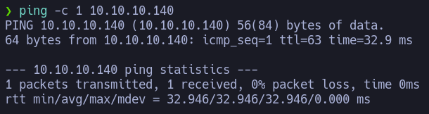

# SwagShop

Dificultad: Easy
OS: Linux

En este writeup, voy a demostrar paso a paso como conseguir el root en la máquina SwagShop.

## Reconocimiento

Primero, aunque aparezca en el icono, es una buena práctica ver qué OS utiliza el objetivo. Para ello utilizaremos el comando **ping -c 1 {IP}** y viendo la ttl podemos saber contra qué nos enfrentamos de manera silenciosa (Linux:64 y Windows:128). En este vemos que es una máquina Linux.



Solo los puertos 22 y 80. Por lo que vamos a ver la página.


Cuándo entramos nos lleva a swagshop.htb, en estos casos hay que añadir la ip y el dominio a /etc/hosts


Una vez en la página vemos que es una tienda, navegando por la web intentando hacer injecciones vemos que no es vulnerable a este tipo de ataques.

Vemos que utiliza Magento

> Magento es una potente plataforma para lanzar sitios de compra y venta de productos online. Es código abierto y está escrita en PHP.


Así que pasamos el wfuzz para descubrir directorios


Como a la hora de navegar la tienda tiene sus funciones después del /index.php, también sacamos directorios web ahí


Y en **swagshop.htb/index.php/admin** encontramos una página interesante, pero no tenemos credenciales.


## Explotación

Buscamos exploits de Magento y rápidamente encontramos uno que va a añadir un usuario administrador al Admin Panel.


Solo tenemos que tener en cuenta que Magento está alojada a partir de /index.php

```python
target = "http://swagshop.htb/index.php" #Cambiamos el target
```


Entramos en la el Admin Panel con las credenciales dadas por el exploit. Y ahora hay muchas formas de conseguir una reverse.


Lo primero que probé fue usar un exploit RCE que vi antes pero se necesitaba autentificación, cosa que ahora tenemos.


Lo único que tenemos que hacer es cambiar la parte de config añadiendo las credenciales que tenemos.

```python
# Config.
username = 'forme'
password = 'forme'
php_function = 'system'  # Note: we can only pass 1 argument to the function
install_date = 'Wed, 08 May 2019 07:23:09 +0000'  # This needs to be the exact date from /app/etc/local.xml
```

Cuándo lo ejecutamos vemos que no funciona y quitando errores de bytes y strings el más importante que intenta crear un formulario que no necesitamos asi que quitamos esa linea.


Después de pegarme mucho con los bytes y strings tenemos ya un RCE


Me copio la reverse shell de seclists y cambio la ip y puerto.


Abro un servidor en python y paso la reverse shell con wget y la ejecuto.


Ahora tengo una reverse shell siendo www-data


Con esta shell podemos leer la flag del user


## Escalada de privilegios

Subo y ejecuto linpeas, para que me de información y ayude a escalar privilegios. Encontramos que este sistema es vulnerable al CVE-2021-4034, PwnKit, un exploit que usando una vulnerabilidad en pkexec, un programa de SUID-root que está instalado en la mayoría de distribuciones Linux por defecto, genera una shell root.


Y así de fácil tenemos la flag del root

