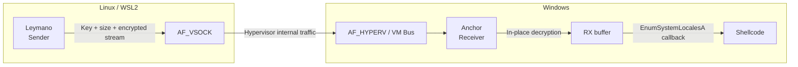

## High-level view

Traveler consists of **two Nim binaries** living on different but coordinated systems:

- **Leymano (Sender – Linux/WSL2)**  
  - OS: Linux / WSL2 (for example, Kali).  
  - Reads the raw shellcode file `payload.bin`.  
  - Generates a 1-byte **session key** and XOR-encrypts the entire buffer in memory.  
  - Opens an `AF_VSOCK` socket targeting `CID 2` (Windows host) and the agreed port (`5005` by default).  
  - Sends: key (1 byte) → size (4 bytes) → encrypted stream.

- **Anchor (Receiver – Windows)**  
  - OS: Windows 10/11 with WSL2 / Hyper-V.  
  - Discovers the active WSL VM GUID by running `hcsdiag list` and applying a regex to its output.  
  - Builds a service GUID from the port (`makeServiceGUID`) and registers it at:  
    `HKLM\SOFTWARE\Microsoft\Windows NT\CurrentVersion\Virtualization\GuestCommunicationServices\<ServiceGUID>`.  
  - Opens an `AF_HYPERV` socket and binds using the WSL `VmId` and the computed `ServiceId`.  
  - Listens for a single connection, receives the stream, decrypts it, and executes the payload via callback.

## Data flow

1. **Payload preparation** on Linux (`payload.bin` in raw format).  
2. **Encryption and send** with Leymano:  
   - Random `sessionKey`.  
   - `xorData(payload, sessionKey)`.  
   - Send key, size, and encrypted buffer over AF\_VSOCK.  
3. **Reception and decryption** with Anchor:  
   - Read key and size from the AF\_HYPERV socket.  
   - Reserve RW memory with `VirtualAlloc`.  
   - Receive the encrypted stream into that buffer.  
   - XOR loop to decrypt in place.  
   - Switch region to RX via `VirtualProtect`.  
4. **Indirect execution**:  
   - Cast the shellcode pointer to the callback type expected by `EnumSystemLocalesA`.  
   - Call the API, which in turn invokes the shellcode as if it were a locale enumeration routine.

## High-level diagram

## See also

- [Overview](/en/arsenal/traveler/overview)
- [Usage](/en/arsenal/traveler/usage)
