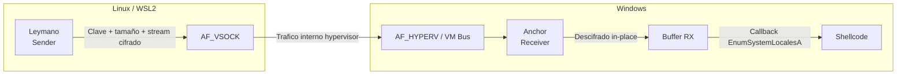

## Vision general

Traveler se compone de **dos binarios Nim** que viven en sistemas distintos pero coordinados:

- **Leymano (Sender – Linux/WSL2)**  
  - Sistema operativo: Linux / WSL2 (por ejemplo, Kali).  
  - Lee el archivo de shellcode crudo `payload.bin`.  
  - Genera una **clave de sesion** de 1 byte y cifra en memoria todo el buffer mediante XOR.  
  - Abre un socket `AF_VSOCK` apuntando a `CID 2` (host Windows) y al puerto acordado (`5005` por defecto).  
  - Envía: clave (1 byte) → tamaño (4 bytes) → stream cifrado.

- **Anchor (Receiver – Windows)**  
  - Sistema operativo: Windows 10/11 con WSL2 / Hyper-V.  
  - Descubre el GUID de la VM WSL actual ejecutando `hcsdiag list` y aplicando regex sobre la salida.  
  - Construye un GUID de servicio a partir del puerto (`makeServiceGUID`) y lo registra en:  
    `HKLM\SOFTWARE\Microsoft\Windows NT\CurrentVersion\Virtualization\GuestCommunicationServices\<ServiceGUID>`.  
  - Abre un socket `AF_HYPERV` y hace `bind` usando el `VmId` de WSL y el `ServiceId` calculado.  
  - Pone un listener que acepta una conexion, recibe el stream, lo descifra y ejecuta el payload por callback.

## Flujo de datos

1. **Preparacion del payload** en Linux (`payload.bin` en crudo).  
2. **Cifrado y envio** con Leymano:  
   - `sessionKey` aleatoria.  
   - `xorData(payload, sessionKey)`.  
   - Envio de clave, tamano y buffer cifrado por AF\_VSOCK.  
3. **Recepcion y descifrado** con Anchor:  
   - Lectura de clave y tamano desde el socket AF\_HYPERV.  
   - Reserva de memoria RW con `VirtualAlloc`.  
   - Recepcion del stream cifrado en ese buffer.  
   - Bucle XOR para descifrar in-place.  
   - Cambio de permisos a RX mediante `VirtualProtect`.  
4. **Ejecucion indirecta**:  
   - Se castea el puntero al shellcode al tipo de callback esperado por `EnumSystemLocalesA`.  
   - Se llama a la API, que a su vez invoca el shellcode como si fuera una funcion de enumeracion.

## Diagrama de alto nivel

## Ver tambien

- [Overview](/es/arsenal/traveler/overview)
- [Usage](/es/arsenal/traveler/usage)
